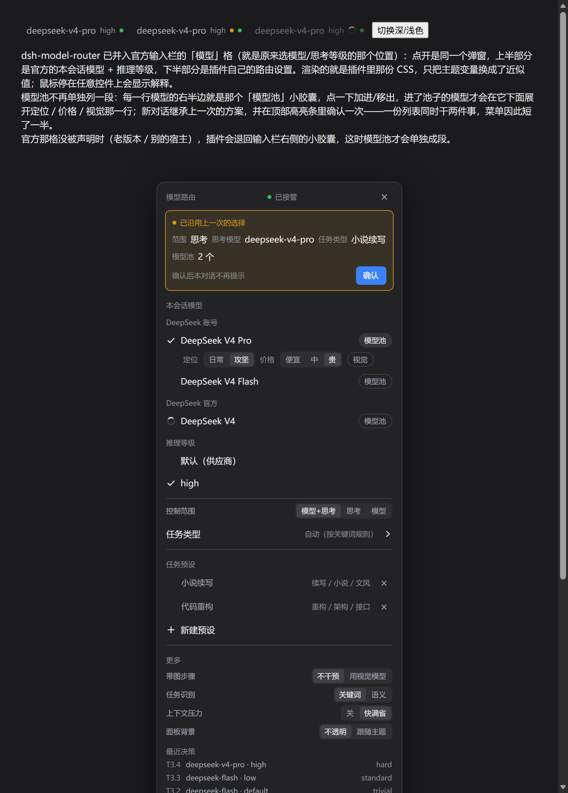
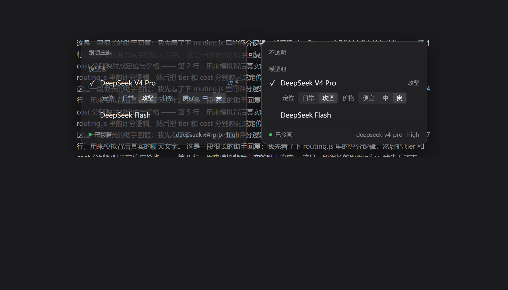

# dsh-model-router

[English](README.md) | 中文

一个 [DeepSeek Harness](https://github.com/deepseek-ai/deepseek-harness) 插件：维护一组模型池，
把每一步路由到其中之一并设定该步的思考等级。思考始终开启——DeepSeek 会拒绝历史中含有
「关闭思考时产生的工具调用」的思考请求。

## 路由表

| 步骤类别 | 判定依据 | 思考等级 | 底层标量 |
| --- | --- | --- | --- |
| `trivial` | 短步骤里的明确廉价意图（翻译、改名、格式化） | `low` | ~50 |
| `standard` | 普通短请求，无工程线索 | `low` | ~50 |
| `engineering` | 工程线索 / 代码·diff·XML 结构 / 工具循环 | `high` | ~75 |
| `hard` | 密集工程简报，或任务内挣来的失败证据 | `high`（`allowMax` 时为 `max`） | ~75 / 100 |

`high` 是默认上限。V4.1-Flash 底层是一个 1–100 的标量，对外只暴露三个预设名；`high` 约等于 75，
正是公开曲线仍然陡峭的位置。再往上拉，输出 token 多花约 1.6–1.8 倍，换来的提升却很边际。

## 授权模式、模型池与任务预设（v0.5）

`control` 决定插件能改什么，而且**手调只在拥有它的那个模式里算数**：改思考等级会让
`full`/`effort` 让位，但不影响 `model`；换模型会让 `full`/`model` 让位，但不影响 `effort`。
让位后插件一直不接管，直到你发下一条命令，或在输入栏控件上点「重新接管」。

| 模式 | 控制范围 |
| --- | --- |
| `full` 模型+思考（Model+Effort） | 模型 + 思考等级 |
| `effort` 思考 | 只作用于**你在面板里选中的那一个模型**，只调它的思考等级 |
| `model` 模型 | 只调模型，思考等级听你的 |

`思考` 模式下，面板会先要求你选中唯一一个模型（`POST /model-router/effort-model`，`/state`
用 `effortModel` / `effectiveEffortModel` 汇报）。**没选之前插件完全不接管**——既不换模型也不改思考
等级。绑定之后，手动换模型不会让它退出（它只管绑定的那个模型），手动改思考等级才会。

客户端半边以优先级 -1 注册进官方 `conversation.input.model` 座位，**接管 composer 的模型格**；它同时
承载官方「本会话模型 + 推理等级」两段和路由器的模式切换、重新接管、任务类型选择与任务预设：**模型池已合并进同一份模型列表**——每行右侧的
「模型池」胶囊点一下把这个模型加进 / 移出池子，进了池子的行会在下面展开定位 / 价格 / 视觉，池里多出来的模型归到「其他模型」一组，菜单因此短了一半。
所有写操作都走同源 `/model-router/*` 路由。

**模型池**：只有池里的模型会被选中。

```yaml
pool:
  - { id: deepseek-official/deepseek-flash, cost: 1, tier: cheap }
  - { id: deepseek-official/deepseek-v4-pro, cost: 8, tier: strong, maxPerTask: 3 }
  - { id: deepseek-official/deepseek-v4-flash-vision-exp, cost: 1, tags: [vision] }
  - { id: vendor-x/writer-pro, cost: 20, weights: { 小说续写: 95 } }
```

`tier: strong` 是困难步骤与证据升级时优先的档位；`cost` 参与 `scoring.costPenalty` 扣分；
`maxPerTask` 限制单个任务能用这个模型几步；一旦池中有模型带 `vision` 标签，带图步骤只在它们
之间选。

**任务预设**：自定义任务类型 + 规则 + 每模型权重。

```yaml
presets:
  小说续写:
    match: ["续写", "小说", "文风", "/chapter\\s+\\d+/i"]
    weights: { "vendor-x/writer-pro": 95, "deepseek-official/deepseek-v4-pro": 60 }
  代码重构:
    match: ["重构", "refactor", "架构"]
    weights: { "deepseek-official/deepseek-v4-pro": 90 }
```

在控件里手动选定的任务类型**优先于规则**；没选才走关键词规则（`classifier: rules`）。第三方模型用
自己的 effort 词表：插件向 provider 查询它支持哪些档位，取最接近的，模型完全不支持思考时就不发
effort 字段。



默认不透明（主题的菜单色本身是半透明，会把背后的聊天内容透上来）：

## 控件就是 composer 的模型格（v0.11.0）

路由器的控件以优先级 **-1** 注册进官方 `conversation.input.model` 座位，低于官方 `ModelSelect`
（优先级 0，来自 `@deepseek-ai/dsh-client-ui-model-selection`）。槽位引擎渲染优先级最低的那个，所以这个
合并控件接管了 composer 的模型格，输入栏只会出现一个控件，而不是在官方选择器旁边再放一个 chip。

这一个控件同时保留两半。官方那一半是 本会话模型 / Session model 与 推理等级 / Reasoning effort，由真正的
ModelDirectory 驱动（`props.directory.store` 订阅、`props.load()`、`props.select({ provider, model,
reasoningEffort })`）：provider/模型分组、当前行的对勾、待选行的转圈、供应商默认行、目录加载 / 出错 /
重试，以及官方「模型 · 等级」的触发器文案。下面才是路由器自己的分组：接管状态、控制范围（模型+思考 /
思考 / 模型）、任务类型，然后是模型列表本身——**模型池折进模型行**：每个会话模型行右侧带一个 模型池 /
Model pool 小胶囊，点它把该模型加入或移出池子，入池的行会在下面展开 定位 / 价格 / 视觉，目录里没有对应
provider 分组的池条目会和「手动填模型 ID」一起归到 其他模型 / Other models。再往下是 任务预设 与 更多。
所有改动都通过同源 `/model-router/*` 路由发给宿主；对话区里每次调用的路由行不变。

旧的 `conversation.input.right` chip（`model-router:composer-control`，order 20）仍然注册着，但它会
**自我收回**——座位注册一落地就把自己 dispose 掉——所以正常宿主渲染出的 `.right` 一列是空的，永远只会看到
合并后的那个控件。只有拒绝或重命名该座位的宿主，才会保留 chip 作为回退。

0.10.0 第一次尝试这么做，0.10.1 已回滚：现场那个座位整格空白，而且一次重启直接启动失败。根因是 cordis
解析 `remote.session` 这类嵌套服务时，会**从调用方所在的 fiber 往上走**，所以客户端插件自己必须先在插件级声明
`sessions`、`remote` 与 `remote.session`，之后方法才能碰 `ModelDirectory.directoryFor()`。插件级 inject 现在
是 `["slots", "uiConversation", "sessions", "remote", "remote.session"]`。

**限制。** 这是注册进官方座位，不是给官方组件打补丁：官方弹层的内部实现（portal 菜单、搜索框、键盘导航、
模块 CSS）没有被复制，只复刻了它的选择语义。如果某个 DSH 不再声明 `conversation.input.model`，座位注册会静默
失败，小号的回退 chip 接管。插件源码改动仍然需要完整重启 `dsh web` / 桌面端。

## 新对话继承上一次的方案并确认一次（v0.13.0）

以前每次启动 DSH 面板都会回到默认值，每个新对话也各按各的来。现在宿主会记住你最后一次设定的方案——控制
范围、绑定的思考模型、钉住的任务类型——存在 `<profile>/.model-router/state.json` 的 `last` 里；自己还没做
过选择的对话就沿用它。选择仍然是分对话的：某个对话一旦自己配过，就以它自己的 `sessions` 条目为准，对话之间
互不影响。

继承来的方案不是你在**这个**对话里做的决定，所以面板顶部会先出现一条警示色高亮条：有可继承的东西时是
「已沿用上一次的选择」，什么都没有时是「新对话：先确认这次的路由方案」。条上列出生效的 范围 / 思考模型 /
任务类型 / 模型池，以及一个「确认」按钮（`POST /model-router/confirm { sessionId, plan }`）；没确认之前
composer 触发器上会有一个脉冲的黄点。确认会把这个方案键记到该会话上——`/state` 回报 `plan`、`planKey`
与 `planConfirmed`——此后本对话不再出现高亮条和黄点；改动控制范围、绑定模型、任务类型或模型池都会产生不同
的键，于是再确认一次。

## 全部点一点就能配（v0.6.2）

输入栏那个控件就是完整的配置入口，不需要写 JSON/YAML：

| 区块 | 操作 |
| --- | --- |
| 模式 | 点「模型+思考 / 思考 / 模型」；「思考」下先选中唯一一个模型；手调后会出现「重新接管」按钮 |
| 任务类型 | 选「自动（按关键词规则）」或某个预设 |
| 模型池 | **从实时模型目录里勾选**，再用下拉设档位 / 成本 / 视觉 |
| 任务预设 | 点「+ 新建预设」→ 点常用词包（写作/代码/翻译/分析）或输入一个词 → 用下拉给每个池内模型选权重 |
| 更多 | 带图步骤、任务识别（规则/语义）、上下文压力 |

所有设置通过同源 `/model-router/*` 路由持久化到 `<profile>/.model-router/state.json`，行配置只是可选默认值。

## 每次调用都标出它的路由（v0.8.0）

对话区里每条工具调用后面都会多一行小字，写明这一步实际用的模型和思考等级：

```
deepseek-official/deepseek-v4-pro · high
```

宿主把会话自己的事件折进 `modelRouterRoute` 会话投影（`stateVersion` 1）：`request/header` 给出当时生效的
provider / model / effort，`step/start` 给出 turn 与 step，`tool/call` 把这一对记在这次调用的 callId 上。
effort 为 `null` 表示默认档由适配器决定，这行就显示本地化的「默认」。投影每个会话保留最近 200 次调用，
超出的从最旧的开始丢。

客户端在每条 `tool/call` 上注册 `model-router-route` 会话 Definition，并通过 `conversation.chat.node` 插槽
渲染，锚在这次调用之后（`+0.1`）。它防御式地读投影：宿主还没折算出这次调用时什么都不显示，而不是借用别的
调用的路由。这一行是工具调用旁边**独立**的小字——原因见[已知限制](#已知限制)。

## 图片、会话信号、子 agent 与语义分类（v0.6.0）

**图片**：`imagePolicy: vision` 会把「带图任务」路由到视觉模型——池里带 `vision` 标签的模型，或
`visionModel` 显式指定的那个。图片是**任务级**的：下一条不带图的命令会回到普通档位。

**会话信号**：插件读取 DSH 的核心投影来细化判断。

| 信号 | 作用 |
| --- | --- |
| 当前 todo（`todos`） | 参与任务类型匹配——计划项比用户那句话更能说明这一步在做什么 |
| 上下文压力 | 超过 `signals.contextPressure`（0–1）时偏向廉价档 |
| token 总量 | 超过 `signals.sessionTokens`（0=关闭）时偏向廉价档 |
| `delegationDepth` | 子 agent 默认走廉价档（`subagent.preferCheap`） |

每个决策都会记录它看到的信号，所以 `/router` 和输入栏控件都能解释「为什么这么选」。

**`/router`**：打印当前授权模式、是否接管、模型池、任务类型、最近若干次决策以及本任务强档花费。

**语义分类**：`classifier: llm` 每轮做一次很小的模型调用挑预设（`classifierModel`、effort off、
`classifierTimeoutMs`），当轮缓存，任何失败都静默回落到关键词规则；默认仍是 `rules`。

## 五条规则

1. **无棘轮。** 轮次深度默认不贡献任何分数（`scoring.turnPerPoint: 0`），工具调用按「当前任务」
   计数。长 agent 循环不会漂向最贵的档位——跑得久 ≠ 任务难。0.9.0 起工具循环只是评分信号，不再单独把类别钉在 `engineering`（`scoring.toolCallClass`）。
2. **升级要证据。** 当前任务里累计 `escalateOnErrors` 个失败的工具结果，或同一个工具调用用相同
   参数重试 `escalateOnRepeats` 次，才升一档，每个任务最多升 `maxEscalations` 档。其它任何东西
   都不能抬高等级。
3. **`max` 是选项。** 除非打开 `allowMax`，auto 模式永远不会发出 `max`。这条在 effort 层面强制，
   就算有人在 `routes` 表里手写 `effort: max` 也会被压回来。
4. **手动选的 `max` 同样降级**（`demoteManualMax`），但只针对本插件管理的模型，别的模型一律不碰。
   打开 `allowMax` 会同时关掉这两个钳制。
5. **思考必须一直开着。** `off` 不再是自动路由。DeepSeek Messages API 会拒绝这样的请求：开启思考
   时，历史里存在一条「关闭思考时产生的、带工具调用」的 assistant 消息（报
   `The content[].thinking in the thinking mode must be passed back to the API`）。廉价步骤照样可能
   调用工具，而同一任务的下一步就是 engineering 工具循环，于是「一步 off、下一步 high」直接让本轮
   失败。现在 `trivial` 走 `low`，任何配置或手动选择的 `off` 都会被抬到 `low`，除非打开
   `allowThinkingOff`。**补救：** 如果某个会话里已经存在这种「无思考的工具调用」消息（旧版本或手动选
   `off` 留下的），路由器会识别出来并让该会话保持 `off`（否则每一步都会失败），同时只提醒一次。想恢复
   思考就压缩该会话或新建会话。

任务边界取自 `agent/inbox/claimed`——那才是真正开启一件新工作的事件。上一个任务以未解决的失败
收尾时，下一个任务只继承「犹豫一档」，且只对 engineering / hard 生效。一句「翻译一下」不会继承
上一次的崩溃。

## 工具循环不再把档位钉在 high（v0.9.0）

0.9.0 之前，`classifyStep` 只要发现某个任务的步骤里已经出现过工具调用，就把它判成 `engineering`
（线索是 `agent tool loop`），而 `engineering` 走 `high`。任务级的工具计数器只在下一条用户命令被
领取时清零，所以从第一次工具调用到最后，整个 Agent 过程都停在 `high`。中途也降不下来：`trivial`
要求既有廉价意图又不超 60 token，`standard` 要求工具调用数为 0，工具一直在来就都够不着。而在默认
`allowMax: false` 下 `max` 会被压回 `high`，于是 `hard` 和 `engineering` 实测一样贵——已经处于
engineering 的任务再靠证据升级也没有任何变化。

修复前的实测：`帮我把这个文件里的日志改成中文` 在 0 次工具时是 `standard`/`low`，从 1、3、6、12、25
次工具起直到任务结束都是 `engineering`/`high`；`翻译一下这句话` 只要调用过一次工具也会变成 `high`。

现在由 `scoring.toolCallClass`（默认 `standard`）决定「工具循环本身能不能换来 engineering」。
`standard` 下工具调用照样加分（`toolCallBase` = 5、`toolCallAt` = 3、`toolCallBig` = 8），但类别由
任务本身（强线索或结构化文本）决定，失败与重复调用仍然按证据升级（`escalateOnErrors` /
`escalateOnRepeats`）。想恢复旧规则就设成 `engineering`；其它取值一律回落到 `standard`。修复后实测：
口语化任务带工具全程 `standard`/`low`，工程任务全程 `engineering`/`high`。`hard` 在
`allowMax: true` 之前依旧压回 `high`；想直接规定每一档的代价，用 `routes.<类别>.effort`（例如
`routes.engineering.effort: low`）。

## 配置

配置写在该插件行里（profile 的 `cordis.patch.yml`）：

```yaml
- id: model-router
  config:
    mode: auto            # auto | off
    model: deepseek-flash
    allowMax: false       # true 时 auto 与手动选择都放开 max
    maxFallback: high     # allowMax 为 false 时 max 压回的目标
    allowThinkingOff: false # true 才重新允许 effort "off"（见规则 5：会打断工具循环）
    control: full         # full | effort | model —— 插件能改什么
    manualOverride:
      yieldOnManual: true        # 手调即让位
      resumeOnNextCommand: true  # 下一条命令自动恢复接管
    pool: []              # 模型池白名单；为空则沿用上面的单模型
    presets: {}           # 任务类型 -> { match: [...], weights: { 模型id: 0-100 } }
    scoring:
      costPenalty: 0.4    # 成本在评分里的扣分权重
      turnPerPoint: 0     # 想让长会话重新变重就调大（不推荐）
      toolCallClass: standard  # 工具循环本身能换来的类别：standard（0.9.0）| engineering（旧规则）
    hysteresis:
      downAfter: 2        # 降档前需要连续几步没有证据
    imagePolicy: keep     # keep | vision —— 带图任务是否路由到视觉模型
    visionModel: null     # 显式视觉模型；不填则用池里带 vision 标签的
    signals:
      todos: true         # 当前 todo 参与任务类型匹配
      contextPressure: 0.75  # 上下文占用超过此比例时偏向廉价档（0 关闭）
      sessionTokens: 0    # 会话 token 超过此值时偏向廉价档（0 关闭）
    subagent:
      preferCheap: true   # 子 agent 默认走廉价档，除非预设权重更高
    classifier: rules     # rules | llm —— llm 每轮做一次小调用
    classifierModel: null # llm 分类用的模型（默认池里第一个）
    escalateOnErrors: 2   # 多少个失败工具结果升一档
    escalateOnRepeats: 3  # 同一工具同参数重试多少次升一档
    routes:
      trivial:     { effort: low }   # 这里写 off 也会被抬到 low，除非 allowThinkingOff
      standard:    { effort: low }
      engineering: { effort: high }
      hard:        { effort: max }
```

环境变量 `DSH_MODEL_ROUTER=off|auto` 可在启动时覆盖 `mode`。

| 键 | 默认 | 说明 |
| --- | --- | --- |
| `mode` | `auto` | `off` 时完全透传（手动 max 钳制除外） |
| `provider` | `deepseek-official` | 只管这一家 |
| `model` | `deepseek-flash` | 唯一被驱动的模型 |
| `familyPattern` | `^deepseek-(flash\|v4)` | 允许接管的会话模型；pro 会话会被拉回 flash |
| `allowMax` | `false` | max 是否可达 |
| `maxFallback` | `high` | max 被压回的目标 |
| `demoteManualMax` | `true` | 是否也降级手动选的 max |
| `allowThinkingOff` | `false` | 是否重新允许 `off`；只适合全程不思考的会话 |
| `control` | `full` | 插件能改什么：`full` / `effort` / `model` |
| `manualOverride.yieldOnManual` | `true` | 拥有它的那种手调是否让位（见上面的授权模式） |
| `manualOverride.resumeOnNextCommand` | `true` | 下一条命令是否自动恢复 |
| `pool` | `[]` | `provider/model` 白名单，支持 `cost`/`tier`/`tags`/`weights`/`maxPerTask` |
| `presets` | `{}` | 任务类型：`match` 规则 + 每模型 `weights` |
| `scoring.costPenalty` | `0.4` | 成本扣分权重 |
| `scoring.toolCallClass` | `standard` | 工具循环本身能换来的类别：`standard`（0.9.0）或 `engineering`（旧规则）；其它取值一律回落到 `standard` |
| `hysteresis.downAfter` | `2` | 降档前的安静步数 |
| `classifier` | `rules` | `rules` 或 `llm`（每轮一次小调用，失败回落规则） |
| `classifierModel` | 池中第一个 | LLM 分类使用的模型 |
| `imagePolicy` | `keep` | `vision` 时带图任务路由到视觉模型 |
| `visionModel` | `null` | 显式视觉模型 id |
| `signals.todos` | `true` | 当前 todo 是否参与任务类型匹配 |
| `signals.contextPressure` | `0.75` | 超过该占用比例偏向廉价档 |
| `signals.sessionTokens` | `0` | 超过该 token 总量偏向廉价档 |
| `subagent.preferCheap` | `true` | 子 agent 是否优先廉价档 |
| `leaveImageSteps` | `true` | 带图步骤保持调用方模型 |
| `imagePolicy` | `keep` | 改成 `flash` 则带图步骤也路由（flash 有原生视觉） |
| `escalateOnErrors` | `2` | 失败证据阈值 |
| `escalateOnRepeats` | `3` | 重复调用阈值 |
| `maxEscalations` | `2` | 单任务最多升几档 |
| `carryUnresolved` | `true` | 未解决的失败是否带一档到下一个任务 |

## 安装

`dsh plugin` 是 pnpm 的前置封装，任何 pnpm 规格都能用。从 npm registry 装：

```sh
dsh plugin --profile web add @neptune810/dsh-model-router
```

或者直接从仓库装：

```sh
dsh plugin --profile web add github:Neptune810/dsh-model-router
```

装完需要重启 `dsh web`。路由器的监听器在启动时注册，刷新页面不够。

## 运行要求

- Node 20 或更新。
- 已在 `@deepseek-ai/dsh` 0.1.7-rc.2 上验证。插件用到 `agent/request`、`agent/inbox/claimed`
  与 `session.deriveMessages()`。没有声明 `engines.dsh` 范围，因此插件市场会保持该条目可见，
  而不是替它猜一个兼容性结论。

## 已知限制

- **没有配置 schema。** 配置直接读 profile 补丁层（见上），不会在设置界面渲染成表单。这是有意
  为之：声明 schema 需要 import `@deepseek-ai/*` 包，而安装在 profile 旁的插件解析不到它们。
- 只处理 `deepseek-official` provider 与匹配 `familyPattern` 的模型。
- **输入栏控件靠注册接管官方模型格，而不是给组件打补丁。** 它以优先级 -1 注册进
  `conversation.input.model`（低于官方 `ModelSelect` 的 0），在自己的面板里保留官方「模型 + 推理等级」
  两段。旧的 `conversation.input.right` chip（`model-router:composer-control`，order 20）会自我收回，
  仅在宿主拒绝该座位时作为回退。0.10.0 的首次尝试现场表现为整格空白，0.10.1 已回滚，因为它没有在插件根
  声明 `sessions` / `remote` / `remote.session`。
- **每次调用的路由是紧跟在调用后面的一行独立小字**，塞不进宿主自带的工具行，也塞不进思考链：keyed slot
  会替换目标，而思考链没有子插槽。宿主还没折算出这次调用时它什么都不显示，而不是猜一个。插件源码改动
  需要重启 `dsh web` 才生效。

## 测试

```sh
node --test
```

133 个用例。`test/policy.test.js`（34 个）覆盖分类、无棘轮、max 不可达、拒绝 `off`、
证据升级、effort 钳制、中毒历史检测、tool-result 错误解析与 `toolCallClass` 开关（默认 `standard`、
`engineering` 恢复 0.9.0 之前的规则、其它取值一律取 `standard`）；`test/routing.test.js`（12 个）覆盖模型池、
预设权重、视觉过滤、`maxPerTask`、effort 词表映射与迟滞；`test/plugin.test.js`（16 个）用 ctx/agent 替身
驱动宿主接线，包括安静的工具循环不再把档位抬到 `high`；`test/modes.test.js`（21 个）覆盖三种模式、手调让位与接管、同源校验、池/预设编辑、手动指定
任务类型、第三方 effort 词表、视觉分流、子 agent 廉价策略、todo 驱动任务类型、上下文压力、`/router` 命令
与 LLM 语义分类；`test/effort-model.test.js`（10 个）覆盖思考模式绑定唯一模型（没选不接管、绑定后清掉待选
标记、只调绑定模型的思考等级、词表取自它自己的池条目、无会话的绑定成为默认值）与按模式区分的手调让位
（思考模式下换模型不算手调、改思考等级才算，模型模式忽略改思考等级，模型+思考对两者都反应）以及新路由的
清空与校验；`test/route-projection.test.js`（12 个）覆盖投影契约（key/stateVersion、纯 JSON 状态、header
折算且「缺省」与「显式 null」等价、turn/step 跟踪、调用当时生效的 header、缺 header/step 时回落到调用自身的
值、重复 callId、按插入顺序丢最旧的 200 条上限、整数型 callId 的顺序、纯函数与 JSON 往返）以及宿主注册与
没有该服务时的加载；`test/client.test.js`（28 个）在 VM 里加载浏览器 bundle 并断言注册（路由行、作为回退且会自我收回的 composer chip、以及注册在 `conversation.input.model` 优先级 -1 上的合并座位）、
闭合的触发器、文档里的同源路由、路由 Definition 的匹配与锚点、路由行
防御式读取投影、本地化默认标签、座位面委托给会话目录、官方选择语义（模型行不带 `reasoningEffort`、思考行
带它、供应商默认行、点当前行是空操作、会话锁定、子 agent 会话不可用、选择失败保留错误、目录出错可重试、
分组顺序）、插件半边原来的控件/池/设置载荷与 `/effort-model` 绑定，以及声明的 `ui-chat` 座位与
`uiConversation` 服务。

## 许可证

MIT
